# BertWithPretrained

\[[中文](README-zh-CN.md)|[English](README.md)\]

This project is an implementation of the BERT model and its related downstream tasks based on the PyTorch framework. It also includes a detailed explanation of the BERT model and the principles of each underlying task.

[BERT: Pre-training of Deep Bidirectional Transformers for Language Understanding](https://arxiv.org/abs/1810.04805)

Before learning to use this project, you need to know the relevant principles of Transformer by these three examples: [Translation](https://github.com/moon-hotel/TransformerTranslation), [Classification](https://github.com/moon-hotel/TransformerClassification), [Coupling Generation](https://github.com/moon-hotel/TransformerCouplet).


 ## Implementations
- [x] [1. Implementing the BERT model from scratch](model/BasicBert)
- [x] [2. Chinese text classification task based on BERT pretraining model](Tasks/TaskForSingleSentenceClassification.py)
- [x] [3. English text implication (MNLI) task based on BERT pretrained model](Tasks/TaskForPairSentenceClassification.py)
- [x] [4. English Multiple Choice (SWAG) task based on BERT pretrained model](Tasks/TaskForMultipleChoice.py)
- [x] [5. English Question Answering (SQuAD) Task Based on BERT pretrained Model ](Tasks/TaskForSQuADQuestionAnswering.py)
- [x] [6. Training BERT tasks from scratch based on NSL and MLM tasks](Tasks/TaskForPretraining.py)
- [x] [7. Named Entity Recognition task based on BERT pretraining model](Tasks/TaskForChineseNER.py)

## Project Structure
- `bert_base_chinese`contains the [bert_base_chinese](https://huggingface.co/bert-base-chinese/tree/main) pre-training model and configuration files

- `bert_base_uncased_english`contains the [bert_base_uncased_english](https://huggingface.co/bert-base-uncased/tree/main) pre-training model and configuration files
- `data`contains all datasets used by each downstream task.
    - `SingleSentenceClassification` is a 15-classes Chinese classification dataset of Toutiao.
    - `PairSentenceClassification` is the dataset of MNLI (The Multi-Genre Natural Language Inference Corpus).
    - `MultipeChoice` is the dataset of SWAG.
    - `SQuAD` is the dataset of SQuAD-V1.1.
    - `WikiText`is the Wikipedia English corpus for pre-training.
    - `SongCi` is SongCi data for Chinese model pre-training
    - `ChineseNER` is a dataset used to train Chinese Named Entity Recognition.
- `model` is the implementation of each module
    - `BasicBert` contains basic BERT implementation
        - `MyTransformer.py` self-attention implementation.
        - `BertEmbedding.py` Input Embedding implementation.
        - `BertConfig.py` used to import configuration of `config.json`.
        - `Bert.py` implementation of bert.
    - `DownstreamTasks` contains all downstream tasks implementation
        - `BertForSentenceClassification.py` sentence(s) classification implementation.
        - `BertForMultipleChoice.py` multiple choice implementation.
        - `BertForQuestionAnswering.py` question answer (text span) implementation.
        - `BertForNSPAndMLM.py` NSP and MLM implementation.
        - `BertForTokenClassification.py` token classification implementation.
- `Task` implementation of training and inference for each downstream task
    - `TaskForSingleSentenceClassification.py` taks of single sentence classification implementation such as sentence classification.
    - `TaskForPairSentence.py`  task of pair sentence classification implementation such as MNLI.
    - `TaskForMultipleChoice.py` task of multiple choice implementation such as SWAG.
    - `TaskForSQuADQuestionAnswering.py` task os question answering (text span) implementation such as SQuAD.
    - `TaskForPretraining.py` tasks of NSP ans MLM implementation.
    - `TaskForChineseNER.py` task of Chinese Named Entity Recognition implementation.
- `test` test cases of each downstream task.
- `utils`
    - `data_helpers.py` is the data preprocessing and dataset building module of each downstream task;
    - `log_helper.py` is the log printing module.
    - `creat_pretraining_data.py` used to construct the dataset of  BERT pre-training task.

## Python Environment
Python 3.6 and packages version
```python
torch==1.5.0
torchtext==0.6.0
torchvision==0.6.0
transformers==4.5.1
numpy==1.19.5
pandas==1.1.5
scikit-learn==0.24.0
tqdm==4.61.0
```
## Usage
### Step 1. Download Dataset 
Downloading each dataset and the corresponding BERT pretrained model (if empty) and putting it in the corresponding directory. For details, see the `README.md` file in each data (`data`) directory.
### Step 2. Runing
Going to the `Tasks` directory and run the model.

### 2.1 Chinese text classification task

Model structure and data processing:

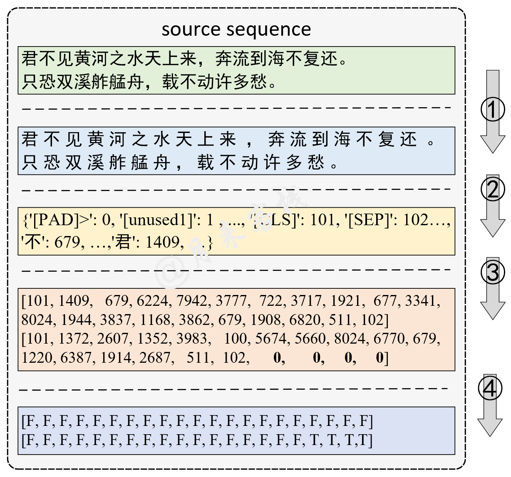

```python
python TaskForSingleSentenceClassification.py
```

Result: 

```python
-- INFO: Epoch: 0, Batch[0/4186], Train loss :2.862, Train acc: 0.125
-- INFO: Epoch: 0, Batch[10/4186], Train loss :2.084, Train acc: 0.562
-- INFO: Epoch: 0, Batch[20/4186], Train loss :1.136, Train acc: 0.812        
-- INFO: Epoch: 0, Batch[30/4186], Train loss :1.000, Train acc: 0.734
...
-- INFO: Epoch: 0, Batch[4180/4186], Train loss :0.418, Train acc: 0.875
-- INFO: Epoch: 0, Train loss: 0.481, Epoch time = 1123.244s
...
-- INFO: Epoch: 9, Batch[4180/4186], Train loss :0.102, Train acc: 0.984
-- INFO: Epoch: 9, Train loss: 0.100, Epoch time = 1130.071s
-- INFO: Accurcay on val 0.884
-- INFO: Accurcay on val 0.888
```

### 2.2 Text Implication

Model structure and data processing:

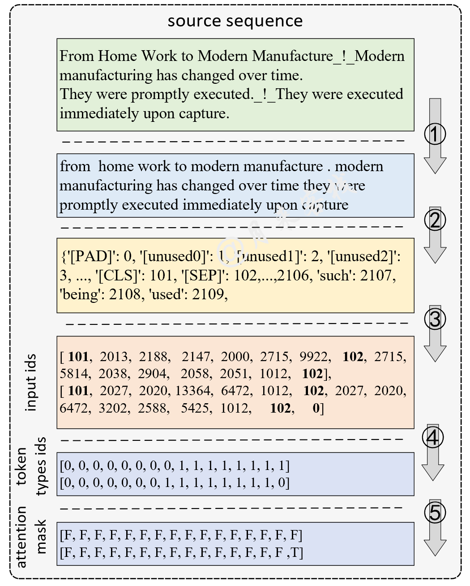

```python
python TaskForPairSentenceClassification.py
```

Result:

```python
-- INFO: Epoch: 0, Batch[0/17181], Train loss :1.082, Train acc: 0.438
-- INFO: Epoch: 0, Batch[10/17181], Train loss :1.104, Train acc: 0.438
-- INFO: Epoch: 0, Batch[20/17181], Train loss :1.129, Train acc: 0.250     
-- INFO: Epoch: 0, Batch[30/17181], Train loss :1.063, Train acc: 0.375
...
-- INFO: Epoch: 0, Batch[17180/17181], Train loss :0.367, Train acc: 0.909
-- INFO: Epoch: 0, Train loss: 0.589, Epoch time = 2610.604s
...
-- INFO: Epoch: 9, Batch[0/17181], Train loss :0.064, Train acc: 1.000
-- INFO: Epoch: 9, Train loss: 0.142, Epoch time = 2542.781s
-- INFO: Accurcay on val 0.827
-- INFO: Accurcay on val 0.830
```

### 2.3 Multiple Choice (SWAG) Task

Model structure and data processing:

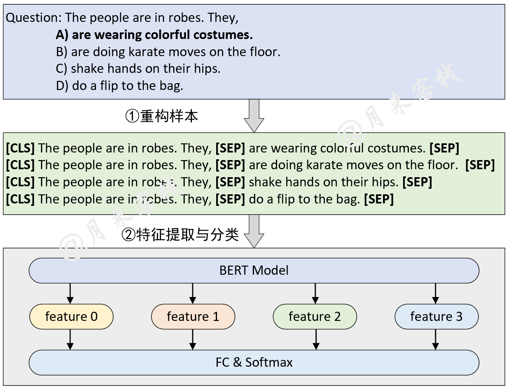

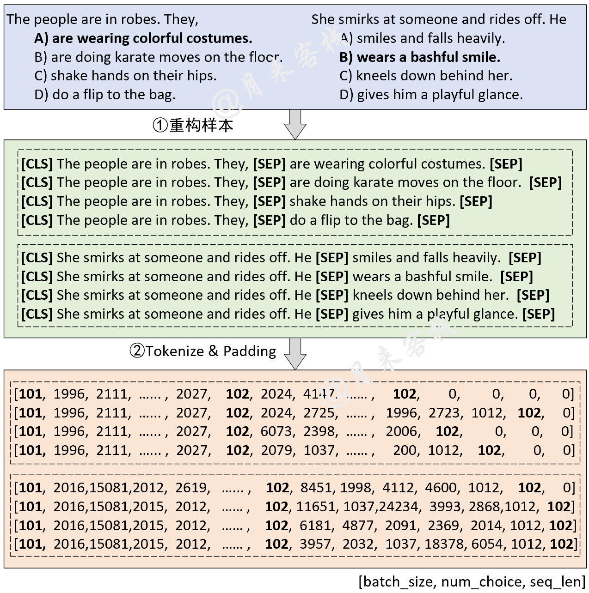

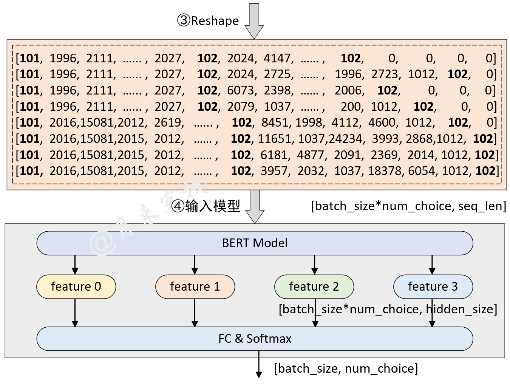

```python
python TaskForMultipleChoice.py
```

Result:
```python
[2021-11-11 21:32:50] - INFO: Epoch: 0, Batch[0/4597], Train loss :1.433, Train acc: 0.250
[2021-11-11 21:32:58] - INFO: Epoch: 0, Batch[10/4597], Train loss :1.277, Train acc: 0.438
[2021-11-11 21:33:01] - INFO: Epoch: 0, Batch[20/4597], Train loss :1.249, Train acc: 0.438
        ......
[2021-11-11 21:58:34] - INFO: Epoch: 0, Batch[4590/4597], Train loss :0.489, Train acc: 0.875
[2021-11-11 21:58:36] - INFO: Epoch: 0, Batch loss :0.786, Epoch time = 1546.173s
[2021-11-11 21:28:55] - INFO: Epoch: 0, Batch[0/4597], Train loss :1.433, Train acc: 0.250
[2021-11-11 21:30:52] - INFO: He is throwing darts at a wall. A woman, squats alongside flies side to side with his gun.  ## False
[2021-11-11 21:30:52] - INFO: He is throwing darts at a wall. A woman, throws a dart at a dartboard.   ## False
[2021-11-11 21:30:52] - INFO: He is throwing darts at a wall. A woman, collapses and falls to the floor.   ## False
[2021-11-11 21:30:52] - INFO: He is throwing darts at a wall. A woman, is standing next to him.    ## True
[2021-11-11 21:30:52] - INFO: Accuracy on val 0.794
```

### 2.4 Question Answering (SQuAD) Task

Model structure and data processing:

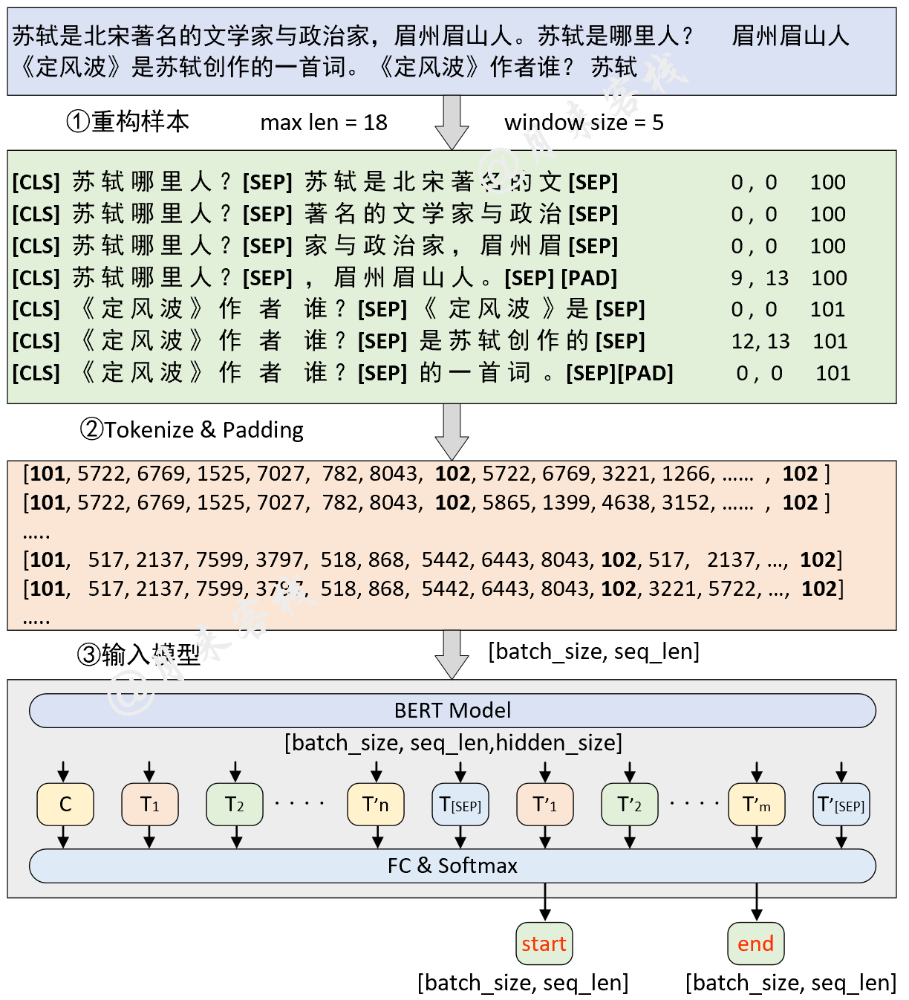

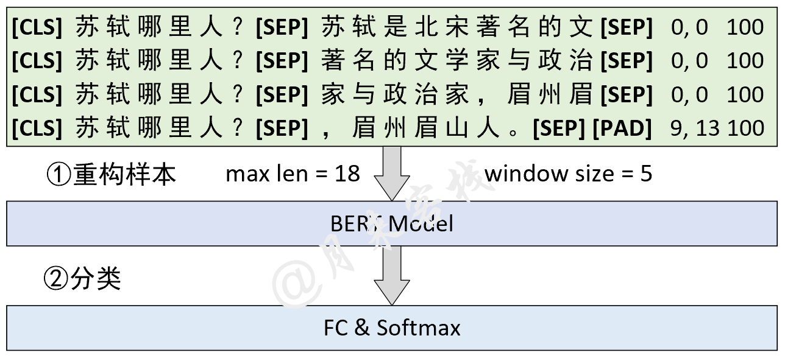

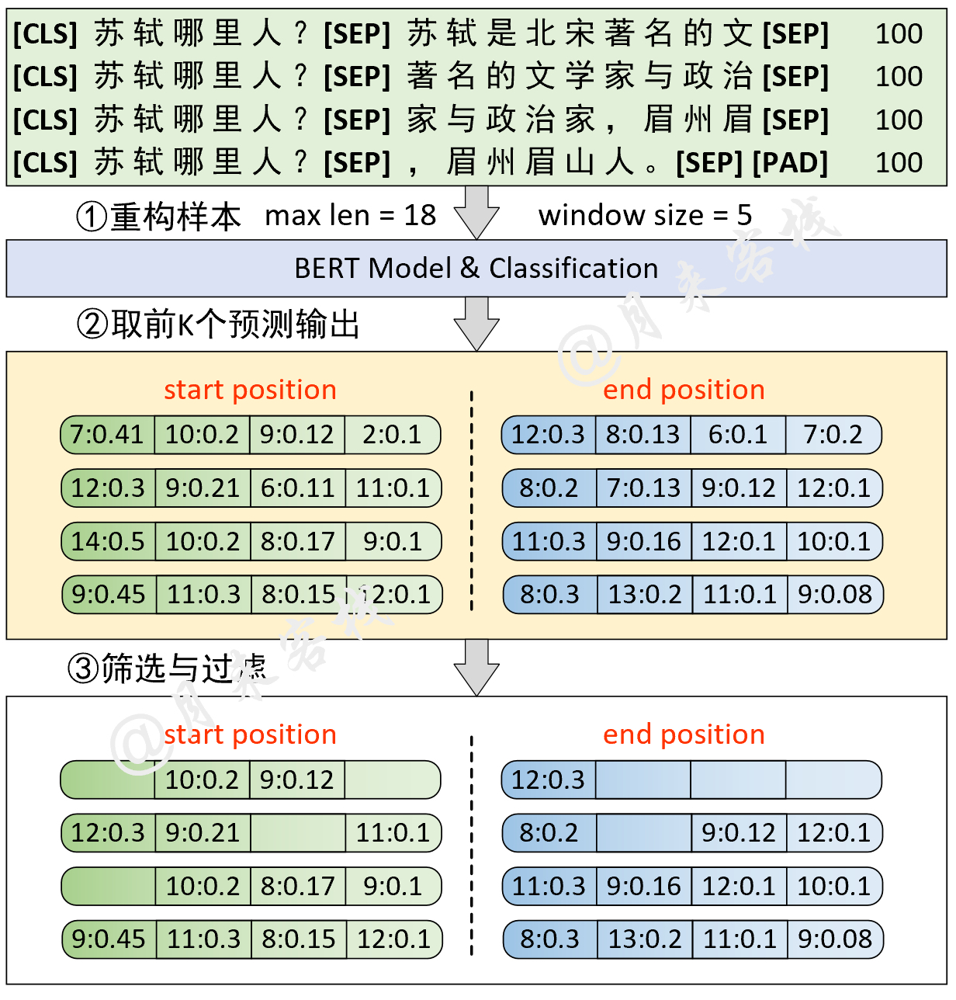

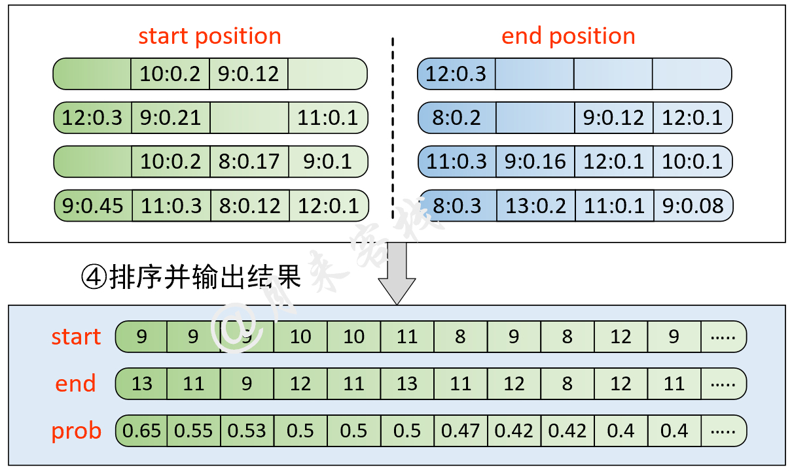

```python
python TaskForSQuADQuestionAnswering.py
```
Result:
```python
[2022-01-02 14:42:17]缓存文件 ~/BertWithPretrained/data/SQuAD/dev-v1_128_384_64.pt 不存在，重新处理并缓存！
[2022-01-02 14:42:17] - DEBUG: <<<<<<<<  进入新的example  >>>>>>>>>
[2022-01-02 14:42:17] - DEBUG: ## 正在预处理数据 utils.data_helpers is_training = False
[2022-01-02 14:42:17] - DEBUG: ## 问题 id: 56be5333acb8001400a5030d
[2022-01-02 14:42:17] - DEBUG: ## 原始问题 text: Which performers joined the headliner during the Super Bowl 50 halftime show?
[2022-01-02 14:42:17] - DEBUG: ## 原始描述 text: CBS broadcast Super Bowl 50 in the U.S., and charged an average of $5 million for a  ....
[2022-01-02 14:42:17]- DEBUG: ## 上下文长度为：87, 剩余长度 rest_len 为 ： 367
[2022-01-02 14:42:17] - DEBUG: ## input_tokens: ['[CLS]', 'which', 'performers', 'joined', 'the', 'headline', '##r', 'during', 'the', ...]
[2022-01-02 14:42:17] - DEBUG: ## input_ids:[101, 2029, 9567, 2587, 1996, 17653, 2099, 2076, 1996, 3565, 4605, 2753, 22589, 2265, 1029, 102, 6568, ....]
[2022-01-02 14:42:17] - DEBUG: ## segment ids:[0, 0, 0, 0, 0, 0, 0, 0, 0, 0, 0, 0, 0, 0, 0, 0, 1, 1, 1, 1, 1, 1, 1, 1, 1, 1, 1, 1, 1, 1, 1, 1, 1, 1, ...]
[2022-01-02 14:42:17] - DEBUG: ## orig_map:{16: 0, 17: 1, 18: 2, 19: 3, 20: 4, 21: 5, 22: 6, 23: 7, 24: 7, 25: 7, 26: 7, 27: 7, 28: 8, 29: 9, 30: 10,....}
[2022-01-02 14:42:17] - DEBUG: ======================
....
[2022-01-02 15:13:50] - INFO: Epoch:0, Batch[810/7387] Train loss: 0.998, Train acc: 0.708
[2022-01-02 15:13:55] - INFO: Epoch:0, Batch[820/7387] Train loss: 1.130, Train acc: 0.708
[2022-01-02 15:13:59] - INFO: Epoch:0, Batch[830/7387] Train loss: 1.960, Train acc: 0.375
[2022-01-02 15:14:04] - INFO: Epoch:0, Batch[840/7387] Train loss: 1.933, Train acc: 0.542
......
[2022-01-02 15:15:27] - INFO:  ### Quesiotn: [CLS] when was the first university in switzerland founded..
[2022-01-02 15:15:27] - INFO:    ## Predicted answer: 1460
[2022-01-02 15:15:27] - INFO:    ## True answer: 1460
[2022-01-02 15:15:27] - INFO:    ## True answer idx: (tensor(46, tensor(47))
[2022-01-02 15:15:27] - INFO:  ### Quesiotn: [CLS] how many wards in plymouth elect two councillors?
[2022-01-02 15:15:27] - INFO:    ## Predicted answer: 17 of which elect three .....
[2022-01-02 15:15:27] - INFO:    ## True answer: three
[2022-01-02 15:15:27] - INFO:    ## True answer idx: (tensor(25, tensor(25))
```
运行结束后，`data/SQuAD`目录中会生成一个名为`best_result.json`的预测文件，此时只需要切换到该目录下，并运行以下代码即可得到在`dev-v1.1.json`的测试结果：
```python
python evaluate-v1.1.py dev-v1.1.json best_result.json

"exact_match" : 80.879848628193, "f1": 88.338575234135
```

### 2.5 NSL and MLM tasks

Model structure and data processing:


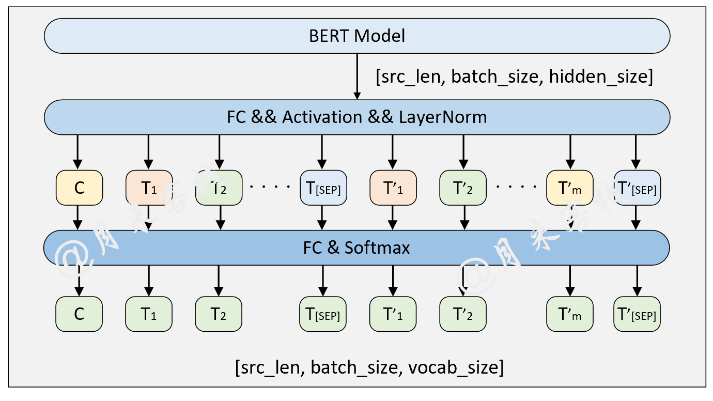

```python
if __name__ == '__main__':
    config = ModelConfig()
    train(config)
    sentences_1 = ["I no longer love her, true, but perhaps I love her.",
                   "Love is so short and oblivion so long."]

    sentences_2 = ["我住长江头，君住长江尾。",
                   "日日思君不见君，共饮长江水。",
                   "此水几时休，此恨何时已。",
                   "只愿君心似我心，定不负相思意。"]
    inference(config, sentences_2, masked=False, language='zh')
```

Result:
```python
- INFO: ## 成功载入已有模型进行推理……
- INFO:  ### 原始：我住长江头，君住长江尾。
- INFO:   ## 掩盖：我住长江头，[MASK]住长[MASK]尾。
- INFO:   ## 预测：我住长江头，君住长河尾。  
- INFO: ====================
- INFO:  ### 原始：日日思君不见君，共饮长江水。
- INFO:   ## 掩盖：日日思君不[MASK]君，共[MASK]长江水。
- INFO:   ## 预测：日日思君不见君，共饮长江水。
#   ......
```

### 2.6 Named Entity Recognition task

Model structure and data processing:

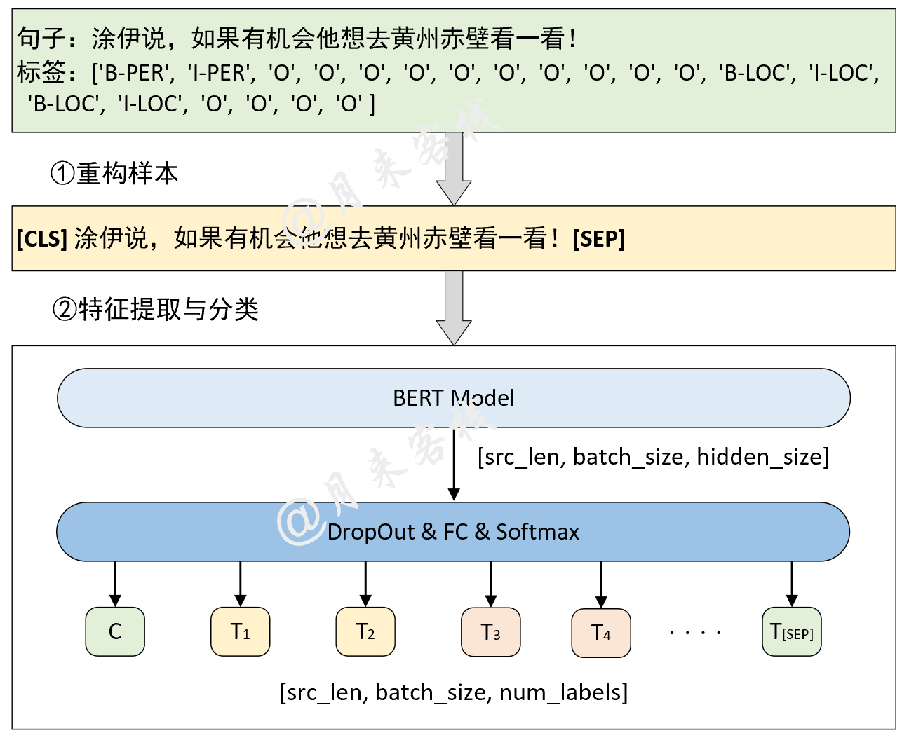

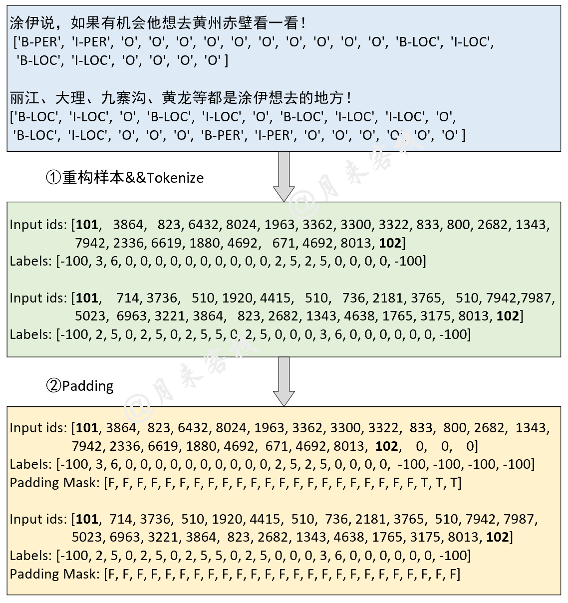

```python
if __name__ == '__main__':
    config = ModelConfig()
    train(config)
    sentences = ['智光拿出石壁拓文为乔峰详述事情始末，乔峰方知自己原本姓萧，乃契丹后族。',
                 '当乔峰问及带头大哥时，却发现智光大师已圆寂。',
                 '乔峰、阿朱相约找最后知情人康敏问完此事后，就到塞外骑马牧羊，再不回来。']
    inference(config, sentences)
```

Result of training:

```python
- INFO: Epoch: [1/10], Batch[620/1739], Train Loss: 0.115, Train acc: 0.96386
- INFO: Epoch: [1/10], Batch[240/1739], Train Loss: 0.098, Train acc: 0.96466
- INFO: Epoch: [1/10], Batch[660/1739], Train Loss: 0.087, Train acc: 0.96435
......
- INFO:句子：在澳大利亚等西方国家改变反倾销政策中对中国的划分后，不少欧盟人士也认识到，此种划分已背离中国经济迅速发展的现实。
- INFO: 澳大利亚：	LOC
- INFO: 中国：	LOC
- INFO: 欧盟：	LOC
- INFO: 中国： LOC
......
              precision    recall  f1-score   support

           O       1.00      0.99      1.00     97640
       B-ORG       0.86      0.93      0.89       984
       B-LOC       0.94      0.93      0.94      1934
       B-PER       0.97      0.97      0.97       884
       I-ORG       0.90      0.96      0.93      3945
       I-LOC       0.91      0.95      0.93      2556
       I-PER       0.99      0.98      0.98      1714

    accuracy                           0.99    109657
   macro avg       0.94      0.96      0.95    109657
weighted avg       0.99      0.99      0.99    109657
```

Result of inference:
```python
- INFO: 句子：智光拿出石壁拓文为乔峰详述事情始末，乔峰方知自己原本姓萧，乃契丹后族。
- INFO: 	智光：	PER
- INFO: 	乔峰：	PER
- INFO: 	乔峰：	PER
- INFO: 	萧：	PER
- INFO: 	丹：	PER
......
```

